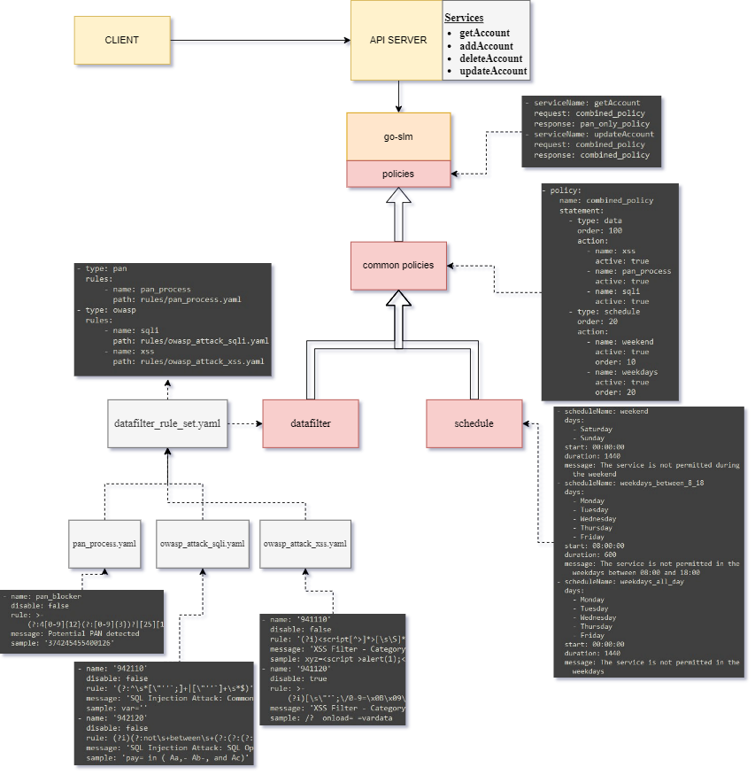

[](https://github.com/xmlking/go-workspace/blob/main/go.mod)
[](https://opensource.org/licenses/MIT)

[](https://codecov.io/gh/kaanaktas/go-slm)

# go-slm

go-slm is a policy-based service level monitoring library that ensures the adherence of policy specifications for each service.

Introduction
------------

go-slm supports service based **data filter** and **schedule** enforcement, allowing users to expand existing data filter rules according to their needs or disable unnecessary ones. 
The rule-sets under **https://github.com/coreruleset/coreruleset** are referenced for Owasp rule definitions and additional configuration files can be created in the same way 
if other rule-sets from Coreruleset are required.

Installation
-------------

`go get github.com/kaanaktas/go-slm`

Configuration
-------------


## datafilter

go-slm implements 3 data filters; **owasp-sqli**, **owasp-xss** and **pan-filtering**, with the default rule definitions for each located in **datafilter/rules**. 
The filter rules' definitions are defined in **datafilter/datafilter_rule_set.yaml** which can be used without any modifications.<br/>


If users want to make any changes to the existing filter rules or add new ones, they must:
* create a custom filter rule definition file and place it in the main project directory which will overwrite any rule defined in the default filter rule definition file.
* generate their own version of **datafilter_rule_set.yaml** with necessary modifications made therein and put it into the main project directory. 
This will enable them to overwrite existing types/rules in the default datafilter_rule_set.yaml or define new types/rules with changes made in their version of datafilter_rule_set.yaml.
* finally, link custom filter files within the custom datafilter_rule_set.yaml for use.

**custom_owasp_attack_sqli.yaml**

```
- name: '942110'
  disable: true
  rule: (?:^\s*[\"'`;]+|[\"'`]+\s*$)
  message: 'Custom message: SQL Injection Attack: Common Injection Testing Detected'
  sample: var=''
- name: new_rule_123
  disable: false
  rule: <new_rule_regex>
  message: <new_rule_message>
  sample: <new_rule_sample>
```
In the example file above, 2 rules are defined for owasp_attack_sqli. As an example, if we place this file in the **/config** directory of the main application,
* the first rule with name=942110 updates and disables the existing rule in the default filter rule file (**datafilter/rules/owasp_attack_sqli.yaml**). 
This allows users to disable a particular rule which is not needed in their own set of rules, while they can also change its message or regex value as desired.
* The second rule with name=new_rule_123 creates a new filter rule and adds it to the package's generated set of rules. 
It should include a <new_rule_regex> for defining the pattern for filtering data, along with an appropriate <new-rule-message> that will be displayed 
when a match is found, and a <new_rule_sample> to demonstrate the rule in action.

**custom_datafilter_rule_set.yaml**

```
- type: owasp
  rules:
    - name: sqli
      path: rules/owasp_attack_sqli.yaml
      custom_path: config/custom_owasp_attack_sql.yaml
```
The **custom_datafilter_rule_set.yaml** file contains a single rule that updates owasp_sqli, leaving the other rules unchanged. 
The rules defined in **custom_owasp_attack_sqli.yaml** will update the rules in **owasp_attack_sqli.yaml** if necessary or add new rules to our rule_set. 
To ensure that the newly created custom_owasp_attack_sqli.yaml file is used, it must be defined in the **GO_SLM_DATA_FILTER_RULE_SET_PATH** environment variable. 
The code to set this environment variable is as follows:

`_ = os.Setenv("GO_SLM_DATA_FILTER_RULE_SET_PATH", "/{directory}/custom_datafilter_rule_set.yaml")
`

Examples of how to set the environment variable can be found in the **/datafilter/testdata** directory.

## schedule

SLM schedule policies allow the specification of the time frames during which an access policy will be enforced. 
This can be achieved by defining a new schedule policy based on days and hours and establishing a priority order among them.

The schedule definition file contains a list of schedule policies with their respective settings. Each policy is assigned a unique 
**scheduleName**, and the days of the week during which it is active are specified under **days**. Additionally, a **start** time and **duration** can be set for each policy, 
which determines the time frame when the policy is enforced.

An example **schedule.yaml** file is shown below:

```
- scheduleName: weekend
  days:
    - Saturday
    - Sunday
      start: 00:00:00
      duration: 1440
      message: The service is not permitted during the weekend
- scheduleName: weekdays
  days:
    - Monday
    - Tuesday
    - Wednesday
    - Thursday
    - Friday
      start: 08:00:00
      duration: 600
      message: The service is not permitted in the weekdays between 08:00 and 18:00
```

The above example shows two schedule policies: **weekend** and **weekdays**. The weekend policy is active on Saturdays and Sundays, and it has a 24-hour duration. 
The weekdays policy is active on weekdays from 8:00 to 18:00 and has a 10-hour duration.

To use this file in an application, the **GO_SLM_SCHEDULE_POLICY_PATH** environment variable needs to be set to the path of the schedule.yaml file, as demonstrated below:

`_ = os.Setenv("GO_SLM_SCHEDULE_POLICY_PATH", "/{directory}/schedule.yaml")
`

The **{directory}** in the above code should be replaced with the actual directory path where the **schedule.yaml** file is located.


## policies

Service level monitoring (SLM) policies provide precise management control and potential enforcement by defining the traffic filtering and request monitoring for a service. 
An SLM policy includes one or more statements that define a reusable common policy. These common policies can be created in a separate definition file, such as **/policy/testdata/common_policies.yaml**, 
and then be reordered in priority order and combined in **policy_rule_set.yaml** to form more complex policies.

The common_policies definition file contains a list of common policies with their respective settings. Each policy is assigned a unique **name**, and its **statement** includes one or more **type** that 
defines the type of the policy and the **action** that should be taken.

An example **common_policies.yaml** file is shown below:

```
- policy:
    name: combined_policy
    statement:
      - type: data
        order: 100
        action:
          - name: xss
            active: true
          - name: pan_process
            active: true
          - name: sqli
            active: true
      - type: schedule
        order: 20
        action:
          - name: weekend
            active: true
            order: 10
          - name: weekdays
            active: true
            order: 20	
- policy:
    name: pan_only_policy
    statement:
      - type: data
        action:
          - name: pan_process
            active: true
- policy:
    name: combined_policy_no_schedule
    statement:
      - type: data
        order: 100
        action:
          - name: xss
            active: true
          - name: pan_process
            active: true
          - name: sqli
            active: true
```

The above example shows three common policies: **combined_policy**, **pan_only_policy**, and **combined_policy_no_schedule**. 
The **combined_policy** policy contains two types of policies, **data** and **schedule**, with the data policy having an order of 100 
and the schedule policy having an order of 20. The **pan_only_policy** policy is a single **data** policy with no order specified. 
The **combined_policy_no_schedule** policy is a variation of the **combined_policy** policy without any **schedule** policies.

To use these policies in an application, the **GO_SLM_COMMON_POLICIES_PATH** environment variable should be set to the path of the **common_policies.yaml** file, as demonstrated below:

`_ = os.Setenv("GO_SLM_POLICY_RULE_SET_PATH", "/{directory}/policy_rule_set.yaml")
`

The **{directory}** in the above code should be replaced with the actual directory path where the **common_policies.yaml** file is located.


**policy_rule_set** definition file contains a list of policies that should be triggered for a service's request and response. 
An example **policy_rule_set.yaml** file is shown below:

```
- serviceName: service_test
  request: combined_policy
  response: pan_only_policy
- serviceName: service_test_2
  request: combined_policy_no_schedule
  response: pan_only_policy
```

The above example shows two policies: **service_test** and **service_test_2**. Both policies have a request policy of combined_policy and a response policy of pan_only_policy, 
except for the service_test_2 policy, which uses combined_policy_no_schedule instead of combined_policy.

To use these policies in an application, the **GO_SLM_POLICY_RULE_SET_PATH** environment variable should be set to the path of the **policy_rule_set.yaml** file, as demonstrated below:

`_ = os.Setenv("GO_SLM_POLICY_RULE_SET_PATH", "/{directory}/policy_rule_set.yaml")
`

The **{directory}** in the above code should be replaced with the actual directory path where the **policy_rule_set.yaml** file is located.


